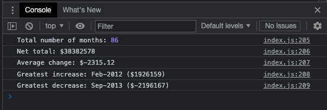

# Console-Finances

## Description

I have been tasked with creating code for analyzing the financial records of a company.
The JavaScript code analyzes the records provided by the company to calculate the following:

* The total number of months included in the dataset.

* The net total amount of Profit/Losses over the entire period.

* The average of the changes in Profit/Losses over the entire period.

* The total change in profits from month to month and the average.

* The greatest increase in profits (date and amount) over the entire period.

* The greatest decrease in losses (date and amount) over the entire period.

This source code is available to everyone under the standard MIT license.
  

Deployed website: https://antonscheving.github.io/Console-Finances/

 

   
Screenshot - Results shown in the console

## Usage

To view the results open the console in the browser by right clinging the browser window and selecting inspect (Chrome browser recommended)

 

## Credits

Front-end web developer: Anton Scheving 
<strong><a href="https://github.com/AntonScheving">GitHub</a></strong>

<strong><a href="https://www.linkedin.com/in/antonscheving/">Linkedin</a></strong>

<strong><a href="https://www.antonscheinvg.com/">AntonScheving.com</a></strong>

 

## License

MIT License

Copyright (c) 2023 Anton Scheving

Permission is hereby granted, free of charge, to any person obtaining a copy
of this software and associated documentation files (the "Software"), to deal
in the Software without restriction, including without limitation the rights
to use, copy, modify, merge, publish, distribute, sublicense, and/or sell
copies of the Software, and to permit persons to whom the Software is
furnished to do so, subject to the following conditions:

The above copyright notice and this permission notice shall be included in all
copies or substantial portions of the Software.

THE SOFTWARE IS PROVIDED "AS IS", WITHOUT WARRANTY OF ANY KIND, EXPRESS OR
IMPLIED, INCLUDING BUT NOT LIMITED TO THE WARRANTIES OF MERCHANTABILITY,
FITNESS FOR A PARTICULAR PURPOSE AND NONINFRINGEMENT. IN NO EVENT SHALL THE
AUTHORS OR COPYRIGHT HOLDERS BE LIABLE FOR ANY CLAIM, DAMAGES OR OTHER
LIABILITY, WHETHER IN AN ACTION OF CONTRACT, TORT OR OTHERWISE, ARISING FROM,
OUT OF OR IN CONNECTION WITH THE SOFTWARE OR THE USE OR OTHER DEALINGS IN THE
SOFTWARE.

---
© 2023 Confidential and Proprietary. All Rights Reserved.